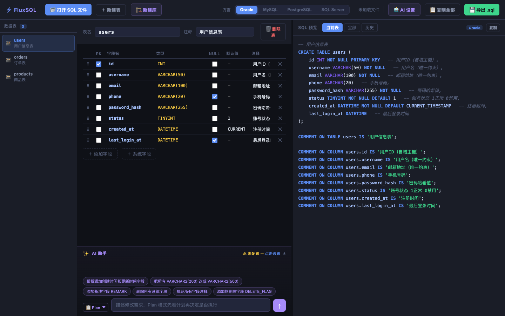
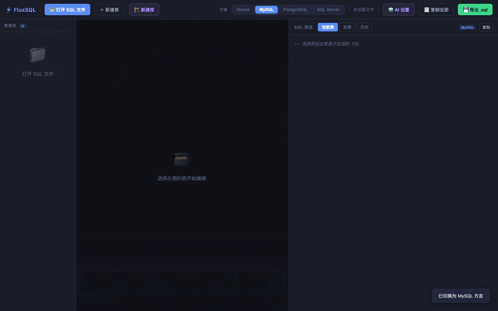
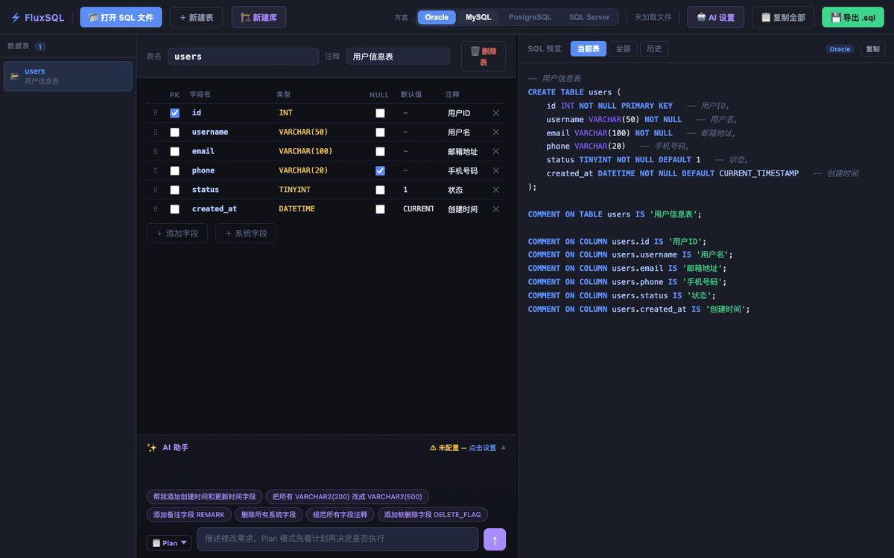
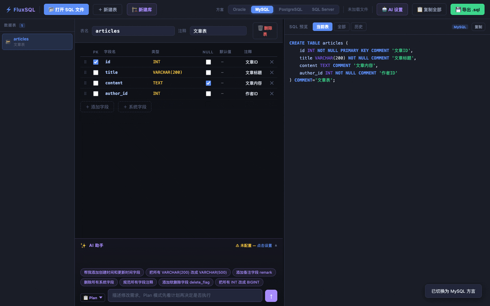
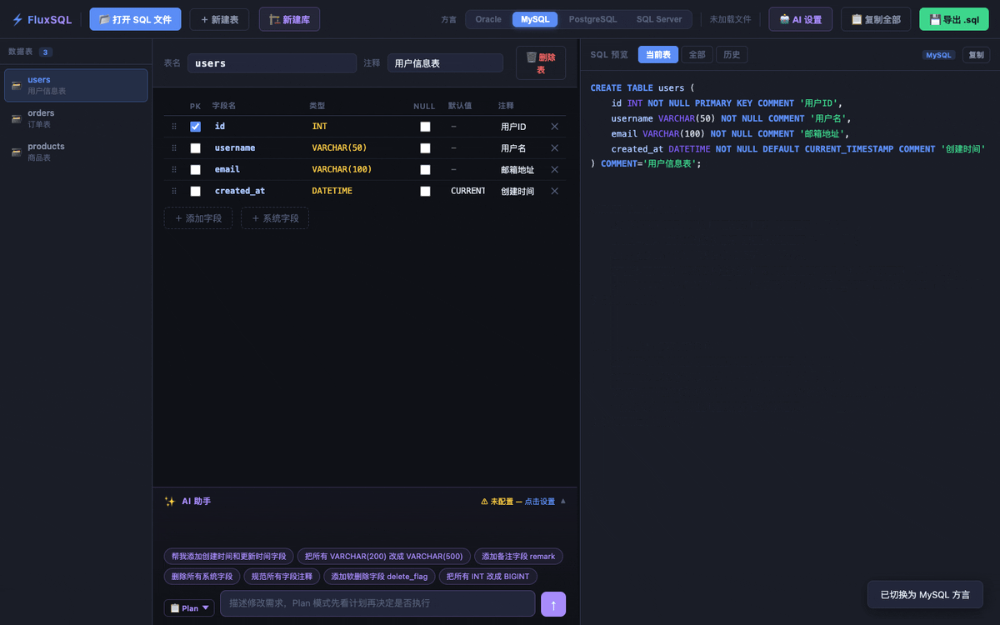
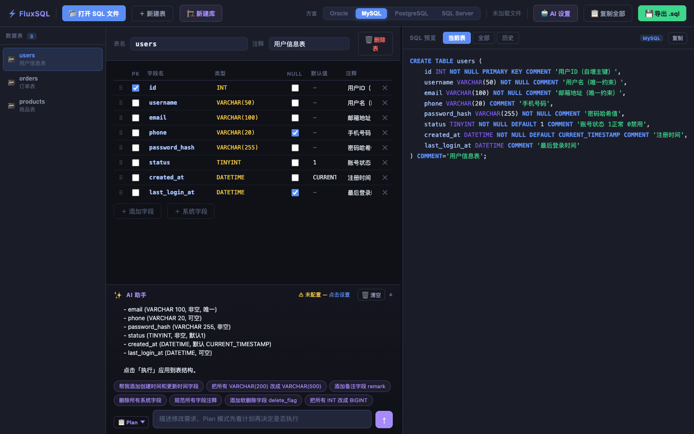
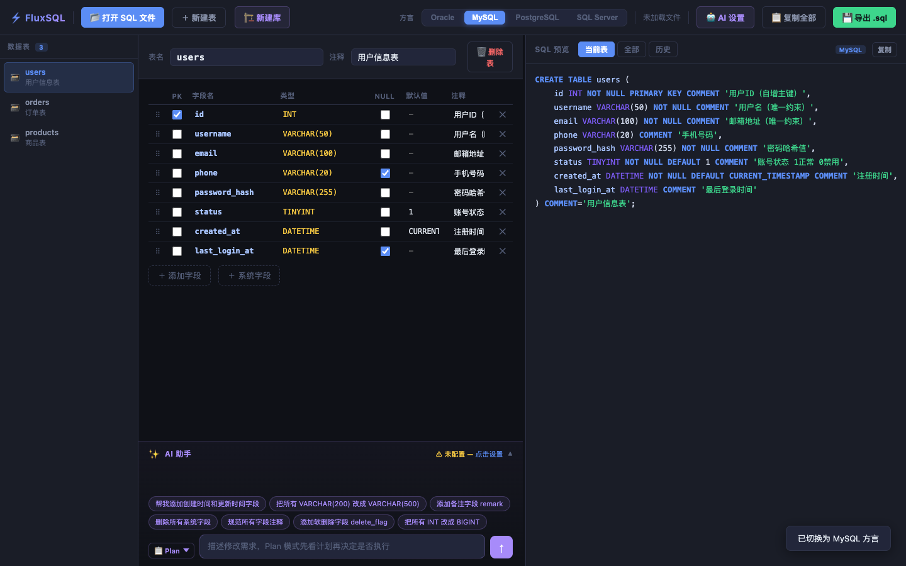
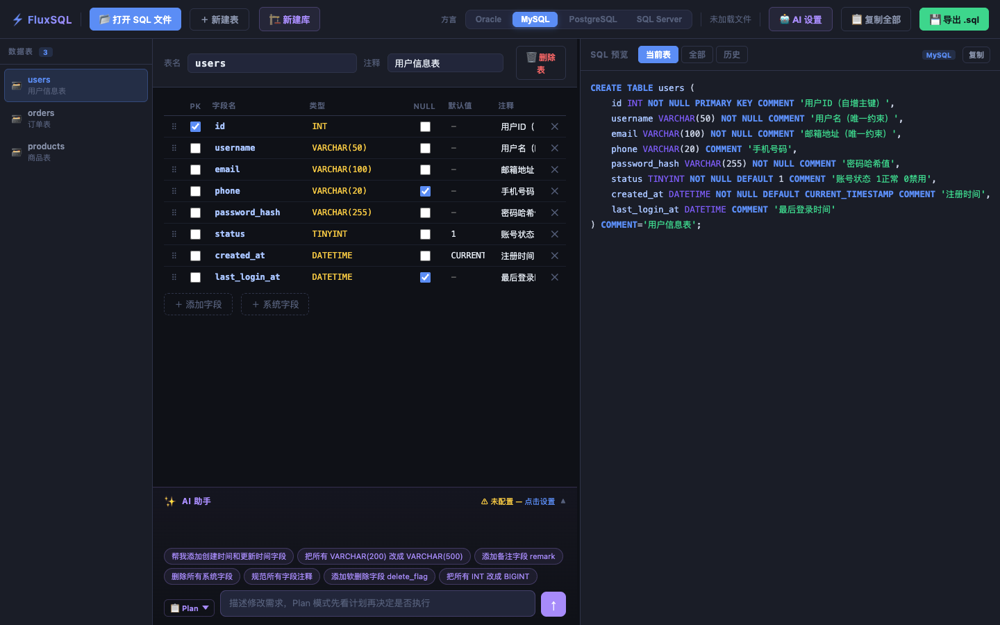

<div align="center">

<h1>⚡ FluxSQL</h1>

<p><strong>AI 驱动的数据库建表工坊</strong></p>

<p>
  <a href="./README_en.md">English</a> · 
  <a href="#快速开始">快速开始</a> · 
  <a href="#功能特性">功能特性</a> · 
  <a href="./docs/user-guide.md">使用指南</a> · 
  <a href="./docs/api-config.md">API 配置</a>
</p>

<p>
  
  
  
  
  
</p>

<br/>

> 用自然语言描述你的表结构，FluxSQL 帮你生成标准 SQL。支持 Oracle、MySQL、PostgreSQL、SQL Server，下载即用，数据完全本地。

<br/>

<!-- 主界面截图 -->


</div>

---

## ✨ 功能特性

| 特性 | 描述 |
|------|------|
| 🤖 **AI 智能建表** | 用自然语言描述，AI 自动生成完整表结构和字段定义 |
| 🗄️ **多数据库支持** | 一键切换 Oracle / MySQL / PostgreSQL / SQL Server 方言 |
| ⚡ **即开即用** | 纯 HTML 单文件，无需安装，双击打开即可使用 |
| 🔒 **完全本地** | 数据存储在浏览器本地，零服务器依赖，隐私安全 |
| 🎨 **可视化编辑** | 直观的表格编辑界面，支持拖拽排序字段 |
| 📤 **灵活导入导出** | 支持 SQL（DDL）和 JSON 格式的导入导出 |
| 💡 **快捷模板** | 内置常见表结构模板（用户、订单、商品等） |
| 🔄 **多表管理** | 在同一个工作区管理多张表，随时切换 |

---

## 🚀 快速开始

只需 **3 步**：

```
1. 下载 index.html
2. 用浏览器打开它（Chrome、Firefox、Safari、Edge 均可）
3. 开始设计你的数据库 ✓
```

**就这么简单！无需安装，无需配置，无需网络。**

> 💡 如需使用 AI 功能，还需配置一个 AI API 密钥（OpenAI / DeepSeek / Kimi 等）。详见 [API 配置说明](./docs/api-config.md)

---

## 🎬 功能演示

### AI 自然语言建表

<!-- GIF：AI建表演示 -->


输入：`"创建一个用户表，包含ID、用户名、邮箱、手机号、创建时间"`  
输出：完整的字段定义，自动识别合适的数据类型

---

### 数据库方言切换

<!-- GIF：数据库切换演示 -->


同一张表，一键在四种数据库语法间切换，SQL 自动适配。

---

### 字段可视化编辑

<!-- GIF：字段编辑演示 -->


拖拽排序、快速设置主键、非空、默认值、注释等属性。

---

### 导入导出

<!-- GIF：导入导出演示 -->


导入现有 SQL 或 JSON，导出标准 DDL 语句。

---

## 📸 界面截图

<table>
  <tr>
    <td></td>
    <td></td>
  </tr>
  <tr>
    <td align="center">主界面</td>
    <td align="center">AI 对话面板</td>
  </tr>
  <tr>
    <td></td>
    <td></td>
  </tr>
  <tr>
    <td align="center">SQL 预览</td>
    <td align="center">数据库方言切换</td>
  </tr>
</table>

---

## 🗄️ 支持的数据库

| 数据库 | 版本 | 特性支持 |
|--------|------|---------|
| **MySQL** | 5.7+ / 8.0+ | AUTO_INCREMENT、ENUM、JSON 等 |
| **PostgreSQL** | 10+ | SERIAL、TEXT、JSONB 等 |
| **Oracle** | 11g+ | NUMBER、VARCHAR2、SEQUENCE 等 |
| **SQL Server** | 2016+ | IDENTITY、NVARCHAR、BIT 等 |

---

## 🤖 AI 功能配置

FluxSQL 支持接入多种 AI 服务，只需提供 API Key：

| 服务商 | 推荐模型 | 特点 |
|--------|---------|------|
| **DeepSeek** | deepseek-chat | 中文效果优秀，价格实惠 |
| **OpenAI** | gpt-4o-mini | 效果稳定，英文较强 |
| **Kimi（Moonshot）** | moonshot-v1-8k | 中文支持好，上下文长 |
| **智谱 AI** | glm-4-flash | 国产，有免费额度 |

> 详细配置步骤见 [docs/api-config.md](./docs/api-config.md)

---

## 📋 使用场景

- **数据库设计** — 快速将需求文档转化为数据库 schema
- **多数据库项目** — 一次设计，输出不同数据库的建表语句  
- **SQL 学习** — 直观了解不同数据库的字段类型和语法差异
- **团队评审** — 可视化展示数据库设计，便于讨论
- **遗留系统整理** — 导入现有 SQL，可视化重新整理

---

## 📂 项目结构

```
FluxSQL/
├── index.html          # 🚀 主程序（下载这个就够了）
├── README.md           # 项目说明（中文）
├── README_en.md        # Project README (English)
├── LICENSE             # MIT 开源协议
├── CHANGELOG.md        # 版本更新日志
├── CONTRIBUTING.md     # 贡献指南
├── assets/
│   ├── screenshots/    # 项目截图
│   └── gifs/           # 功能演示动图
└── docs/
    ├── user-guide.md   # 详细使用指南（中文）
    ├── user-guide_en.md # User Guide (English)
    └── api-config.md   # AI API 配置说明
```

---

## 🛠️ 技术栈

- **纯前端**：HTML5 + CSS3 + Vanilla JavaScript
- **零依赖**：无任何第三方框架或库
- **本地存储**：浏览器 localStorage
- **AI 接入**：标准 REST API（兼容 OpenAI 格式）

---

## 🗺️ 路线图

- [ ] 表关系图（ER 图）可视化
- [ ] 更多数据库支持（SQLite、TiDB 等）
- [ ] 批量建表模式
- [ ] 暗色/亮色主题切换
- [ ] 多语言界面（i18n）
- [ ] 导出为 Markdown 文档

---

## 🤝 参与贡献

欢迎提交 Issue 和 Pull Request！请先阅读 [CONTRIBUTING.md](./CONTRIBUTING.md)

1. Fork 本仓库
2. 创建特性分支 (`git checkout -b feature/AmazingFeature`)
3. 提交更改 (`git commit -m 'Add some AmazingFeature'`)
4. 推送分支 (`git push origin feature/AmazingFeature`)
5. 提交 Pull Request

---

## 📄 开源协议

本项目基于 [MIT License](./LICENSE) 开源。

---

## 🙏 致谢

感谢所有使用和支持 FluxSQL 的朋友！如果这个工具对你有帮助，请给个 ⭐ Star 支持一下！

---

<div align="center">
  <sub>Made with ❤️ | <a href="./README_en.md">English Version →</a></sub>
</div>
